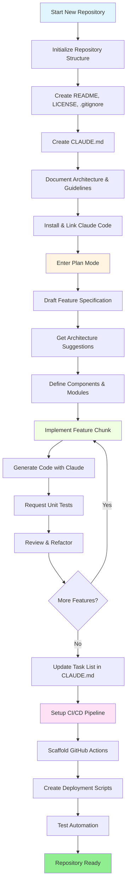
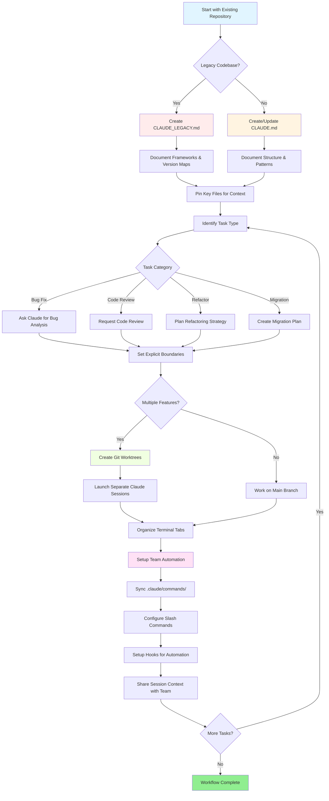

# List of good resources

## Mastering Claude Code in 30 Minutes

_Video_: https://www.youtube.com/watch?v=6eBSHbLKuN0

_**All Tips**_
- **Explore Advanced Features and Shortcuts**
  - Regularly check Claude's new code editing and context features in their release notes.
  - Learn keyboard shortcuts to switch between chat, file, and editor views quickly.

- **Efficient Setup**
  - Create project-specific sessions with clear names/descriptions for easy retrieval.
  - Pin most-used files or folders so Claude can access them at any time.
  - Set up Claude's integrations (e.g., GitHub, popular IDEs) to streamline your coding process.

- **Effective Codebase Q&A**
  - Ask Claude detailed questions about architecture, design patterns, and specific modules.
  - Use file and line references in your questions (e.g., "What does the logic in `app/models/user.py` accomplish?").
  - For large codebases, provide a summary or manifest to help Claude focus.
  - **Example prompt**: _"Can you explain the authentication flow implemented in src/auth/AuthService.ts:45-120? How does it integrate with the middleware in src/middleware/auth.ts?"_

- **Code Editing & Refactoring**
  - Use inline comments or requests in code blocks to get focused edits ("Refactor this function for clarity").
  - Ask for side-by-side before/after comparisons.
  - Let Claude generate tests or documentation after major edits for quality assurance.
  - **Example prompt**: _"Refactor the getUserData function in api/users.js to use async/await instead of promises. Show me a before/after comparison and generate unit tests for the refactored version."_

- **Context Management**
  - Limit your pasted code/context to only what's relevant for the current task.
  - Use structured prompts ("Here's file A, here's function B, my question is X") for best performance.
  - Remove or collapse large files in the prompt window to avoid exceeding context limits.
  - **Example prompt**: _"Here's the User model from models/User.js and the validateUser function from utils/validation.js. My question is: how can I add email validation while maintaining backward compatibility?"_

- **Integrate Team Tools**
  - Connect Claude sessions to your team's repositories and documentation.
  - Use built-in templates or create custom ones for recurring engineering tasks.
  - Collaborate by sharing session transcripts and prompts with teammates.

- **Boosting Performance**
  - Give Claude clear, goal-oriented instructions (e.g., "Summarize this class in five bullet points").
  - Trim unnecessary comments and boilerplate from context windows.
  - If Claude's output is off track, reset context or rephrase questions for better alignment.
  - **Example prompt**: _"Summarize the DatabaseManager class in src/db/Manager.ts in five bullet points, focusing on its main responsibilities and key methods."_

- **Practical Use Examples**
  - Debugging: Paste errors and stack traces, then ask for possible causes and fixes.
  - Test Generation: Request property-based, unit, or integration tests for complex logic.
  - Code Reviews: Ask Claude to identify risky changes, edge cases, or code smells.
  - **Example prompts**:
    - _"I'm getting this error: 'TypeError: Cannot read property 'map' of undefined at line 42 in components/UserList.jsx'. Here's the stack trace and the relevant code. What's causing this and how can I fix it?"_
    - _"Generate comprehensive unit tests for the PaymentProcessor class, including edge cases for failed transactions, timeouts, and invalid inputs."_
    - _"Review this pull request diff and identify potential security issues, performance bottlenecks, and code smells."_

- **Workflow Automation**
  - Script repetitive tasks (like formatting, clean-ups, and repetitive renaming) using Claude prompts.
  - Use Claude to draft PR descriptions, release notes, or documentation based on code diffs.
  - **Example prompt**: _"Based on the git diff, create a detailed PR description with a summary of changes, list of modified files, testing steps, and potential impacts. Also generate release notes for version 2.3.0."_

**Tip**: For best results, combine several of these practices—start by pinning critical files and summarizing your goals, then use focused prompts and Claude’s refactoring tools to incrementally improve your codebase and automation.

**Recommended workflow with Claude Code**

### Recommended Workflow with Claude Code

#### For a New Repository

1. **Initialize the Repo & Claude Integration**
   - Set up your new repository with essential structure: README, LICENSE, .gitignore, root configs.
   - Create a `CLAUDE.md` file describing the architecture, high-level goals, and coding guidelines.
   - Install Claude Code and link it to your repository for code suggestions, test scaffolding, and workflow automation.

2. **Use Plan Mode and Specs**
   - Use plan mode (`shift-tab` or `/plan`) to draft a detailed specification before implementing features.
   - Ask Claude for architecture suggestions and initial project layout.
   - Keep a clear, goal-oriented prompt sequence—ask for component outlines, major modules, and responsibilities.

3. **Iterative Develop & Review**
   - Implement core features in small chunks, prompting Claude for code generation, refactoring, and documentation.
   - Request unit tests and examples after each increment.
   - Maintain a running task list in CLAUDE.md.

4. **Automate CI/CD and Deployment**
   - Use Claude to scaffold GitHub Actions, npm/yarn scripts, or deployment workflows.
   - Adapt pipelines easily by updating your CLAUDE.md and requesting corresponding commands/scripts.

#### For an Existing Repository

1. **Repository & Context Setup**
   - Add or update `CLAUDE.md` to document repo structure, coding patterns, and key files. For legacy repos, use `CLAUDE_LEGACY.md` covering frameworks, version maps, instructions, bugs, and upgrade notes.
   - Pin or highlight main files Claude should use for context.

2. **Contextual Code Q&A**
   - Ask Claude for code reviews, bug explanations, refactors, or migration plans referencing specific files/functions.
   - Give Claude explicit boundaries (e.g., "modify only these files" or "no new dependencies").

3. **Branch, Worktree, and Multi-Session Management**
   - Use multiple git worktrees for isolated features or bug fixes and launch separate Claude sessions per worktree.
   - Keep terminal tabs/windows organized by branch or feature for parallel workflows.

4. **Team Tools and Automation**
   - Synchronize custom commands via `.claude/commands/` for cross-team consistency.
   - Automate repetitive tasks, PR creation, and code formatting via Claude's slash commands or hooks.
   - Share sessions and context with team members for collaborative troubleshooting and review.

**Tips**:
- Start each new feature or fix with a spec and plan mode prompt.
- For legacy and complex repos, store detailed guidance in CLAUDE.md/CLAUDE_LEGACY.md.
- Give clear, focused instructions and break down complex work into multi-phase plans.
- Regularly clean up sessions, prune context, and remove completed worktrees to avoid clutter.

These steps capture the core recommendations for smooth workflows with Claude Code in both new and existing codebases.
